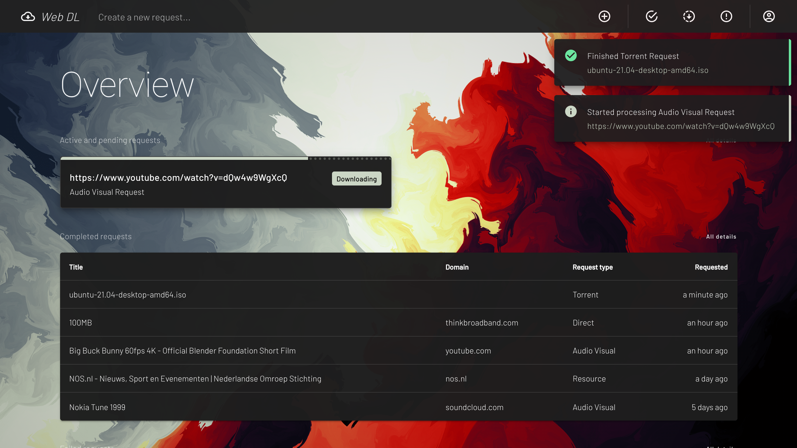

# Web DL Website



**Web DL website** is a Vue.js SPA Website built to fully integrate the Web DL API and all of its features. 
It's the official browser client for the Web DL tools stack.

### Some features
* Responsive for all screen sizes, from mobile to ultra-wide.
* Compiled for all modern web browsers.
* 100% integrated with Web DL API.
* Authenticated user access to resources and files.
* Websocket live connection for automatic status and progress updates.
* Charts for data storage insights.
* Even more...

## Configuration
Configuration for the Web DL Website is managed by an environment file. A base example is provided in the
repository as _.env.dist_. Please copy and rename this file to _.env_ and fill in the values.

| Property               | Description                           | Required | Example                                               |
|------------------------|---------------------------------------|----------|-------------------------------------------------------|
| **VUE_APP_API_URL**    | The URL of the Web DL API             | Yes      | http://localhost:8000/api/                            |
| **VUE_APP_SENTRY_DSN** | The DSN URL for Sentry error tracking | No       | https://1234567890abcdef@12345.ingest.sentry.io/67890 |

## Installation
The WeB DL Website requires the following software and OS to be installed:

- Operating System[^1]
    - Apple macOS Mojave 10.14 or higher (Intel chip)[^2]
    - Microsoft Windows 10 Home/Pro 2004 (build 19041), Enterprise/Education 1909 (build 18363) or higher (64-bit)
- [Docker Desktop](https://www.docker.com/products/docker-desktop) 

[^1]: On lower versions of macOS, Windows, or on Linux, the 
[Docker Engine](https://hub.docker.com/search?offering=community&operating_system=linux&q=&type=edition)
can also be installed, although the Web DL Website was not originally developed using this tool.
[^2]: Docker Desktop for Mac on Apple silicon is available but requires a 
[manual install of Rosetta 2](https://docs.docker.com/docker-for-mac/apple-silicon/#system-requirements).

### Runtime environment
- Docker 18.09.2+
- Docker Compose 1.23.2+

### Startup guide
Prepare and start the required containers.
``` bash
$ make build && make start
```

### Update guide
Shutdown, update and restart the containers.
``` bash
$ make update && make start
```

### Shutdown and cleaning up guide
Stop, shutdown and remove the running containers and all images.
``` bash
$ make stop && make clean
```

## Development
For development the Web DL Website requires the following software to be installed:
- [Node.js](https://nodejs.org/en)
- [Yarn](https://classic.yarnpkg.com/en/docs/install/#mac-stable)
- Several additional packages installed via Yarn

### Runtime environment
- Node.js 15.5.1+
- yarn 1.22.5+

### Project setup
Install all required dependencies in order to run and develop the application.
``` bash
$ yarn install
```

### Live serving
Compiles and hot-reloads the application for development.
``` bash
$ yarn serve
```

### Lint
Lints and fixes files.
``` bash
$ yarn lint
```

### Build
Compiles and minifies the application for production.
``` bash
$ yarn build
```

### Dockerize
Build production container(s) for testing purposes.
``` bash
$ make build && make start_debug
```
