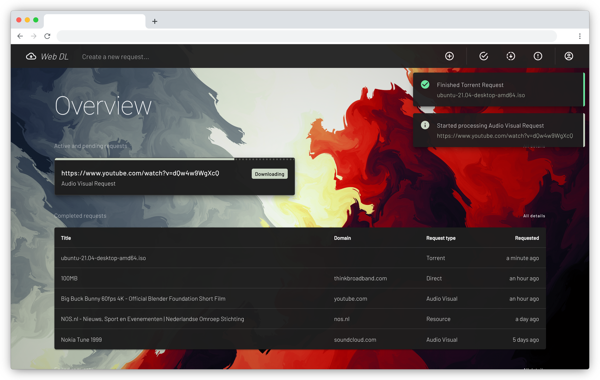

# Web DL Website




**Web DL website** is a Vue.js SPA Website built to fully integrate the Web DL API and all of its features. 
It's the official browser client for the Web DL tools stack.

## Installation
The Wel DL Website requires the following software and OS to be installed:

- Apple macOS Yosemite 10.10.3+ or Microsoft Windows 10 Professional/Enterprise 64-bit
- [Docker Desktop](https://www.docker.com/products/docker-desktop) 

On lower versions of macOS, Windows, or on Linux, the 
[Docker Engine](https://hub.docker.com/search?offering=community&operating_system=linux&q=&type=edition)
can also be installed, although the Web DL Website was not originally developed using this tools.

### Runtime environment
- Docker 18.09.2+
- Docker Compose 1.23.2+

### Startup guide

 - Open a terminal window in the project folder.
 - Run the following code to prepare and start the required containers.

``` bash
$ make build && make start
```

### Update guide

 - Open a terminal window in the project folder.
 - Run the following code to update the containers.

``` bash
$ make stop && make clean
$ make update
```

### Shutdown guide

 - Open a terminal window in the project folder.
 - Run the following code to stop and remove the running containers.

``` bash
$ make stop && make clean
```

## Development
For development the Wel DL Website requires the following software to be installed:

- [Node.js](https://nodejs.org/en)
- [Yarn](https://classic.yarnpkg.com/en/docs/install/#mac-stable)

In additional several packages will be installed via Yarn.

### Runtime environment
- Node.js 15.5.1+
- yarn 1.22.5+

### Project setup
``` bash
$ yarn install
```

### Compiles and hot-reloads for development

``` bash
$ yarn serve
```

### Lints and fixes files

``` bash
$ yarn lint
```

### Compiles and minifies for production

``` bash
$ yarn build
```

### Customize configuration
See [Configuration Reference](https://cli.vuejs.org/config/).
